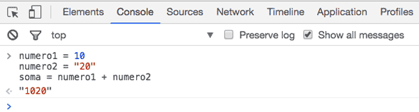
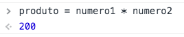

# Para saber mais

## Snake_Case

O Python utiliza por convenção o padrão Snake_Case para nomes de variáveis (ou identificadores).

Um exemplo de variáveis em Snake_Case são:
``` py
idade_esposa = 20
perfil_vip = 'Flávio Almeida'
recibos_em_atraso = 30
```
Em outras linguagens também se usa o padrão CamelCase. O mesmo exemplo com CamelCase (que não é o padrão do Python):
``` py
idadeEsposa = 20
perfilVip = 'Flávio Almeida'
recibosEmAtraso = 30
```
Vamos seguir o padrão do Python nesse curso, que é o Snake_Case!

## JavaScript vs Python

Muito pode se falar na comparação das duas linguagens, mas para esse exercício vamos focar nas operações de adição e multiplicação. Vimos que o Python apenas soma valores de tipos numéricos, ou seja, o exemplo seguir não funciona por causa do tipo str:

``` py
numero1 = 10
numero2 = "20"
soma = numero1 + numero2
TypeError: unsupported operand type(s) for +: 'int' and 'str'
```

Agora, o que acontece com o mesmo código no mundo JavaScript? Você pode testar isso facilmente dentro do seu navegador, apertando F12 para abrir o seu console. Nele, digite o mesmo código:



Repare que o JavaScript concatena os valores, criando a string: "1020"

Você pode pensar que isso faz sentido, já que a variável numero2 é do tipo string, no entanto o que o JavaScript faz é uma conversão implícita. O JavaScript converte a variável numero1 automaticamente para string, e isso pode ser perigoso.

Vou tentar dar mais um exemplo com JavaScript. Agora vamos multiplicar numero1 com numero2:

``` javascript
numero1 = 10
numero2 = "20"
produto = numero1 * numero2
```



Repare que o JavaScript multiplicou e imprimiu 200! Agora também aconteceu uma conversão automática, mas dessa vez a variável numero2 foi convertida para int. Novamente, o JavaScript é tolerante nesse aspecto e converte quando julga necessário. O Python é mais rígido nesse sentido e não faz essas conversões implícitas.
Ótimo, então vamos testar a multiplicação com Python:

``` py
numero1 = 10
numero2 = "20"
produto = numero1 * numero2
print(produto)
```

O resultado nos surpreende:

``` py
20202020202020202020
```

Não deu erro e sim imprimiu 10 vezes 20! Mas eu não acabei de falar que o Python é rígido e não converte automaticamente?

Falei e na verdade não aconteceu uma conversão automática/implícita. Trata-se apenas de um syntax sugar do mundo Python. Um syntax sugar, açúcar sintático da linguagem, apenas simplifica algo que seria trabalhoso, mas não muda a característica da linguagem. Então, ao invés de escrever dez vezes o número 20, podemos simplificar e escrever 10 * "20". Tudo bem?
