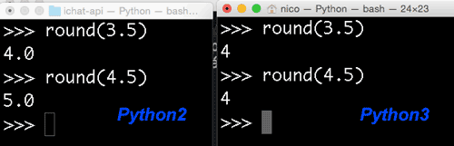

# Para saber mais

## Snake_Case

O Python utiliza por convenção o padrão Snake_Case para nomes de variáveis (ou identificadores).

Um exemplo de variáveis em Snake_Case são:
``` py
idade_esposa = 20
perfil_vip = 'Flávio Almeida'
recibos_em_atraso = 30
```
Em outras linguagens também se usa o padrão CamelCase. O mesmo exemplo com CamelCase (que não é o padrão do Python):
``` py
idadeEsposa = 20
perfilVip = 'Flávio Almeida'
recibosEmAtraso = 30
```
Vamos seguir o padrão do Python nesse curso, que é o Snake_Case!

## JavaScript vs Python

Muito pode se falar na comparação das duas linguagens, mas para esse exercício vamos focar nas operações de adição e multiplicação. Vimos que o Python apenas soma valores de tipos numéricos, ou seja, o exemplo seguir não funciona por causa do tipo str:

``` py
numero1 = 10
numero2 = "20"
soma = numero1 + numero2
TypeError: unsupported operand type(s) for +: 'int' and 'str'
```

Agora, o que acontece com o mesmo código no mundo JavaScript? Você pode testar isso facilmente dentro do seu navegador, apertando F12 para abrir o seu console. Nele, digite o mesmo código:


Repare que o JavaScript concatena os valores, criando a string: "1020"

Você pode pensar que isso faz sentido, já que a variável numero2 é do tipo string, no entanto o que o JavaScript faz é uma conversão implícita. O JavaScript converte a variável numero1 automaticamente para string, e isso pode ser perigoso.

Vou tentar dar mais um exemplo com JavaScript. Agora vamos multiplicar numero1 com numero2:

``` javascript
numero1 = 10
numero2 = "20"
produto = numero1 * numero2
```


Repare que o JavaScript multiplicou e imprimiu 200! Agora também aconteceu uma conversão automática, mas dessa vez a variável numero2 foi convertida para int. Novamente, o JavaScript é tolerante nesse aspecto e converte quando julga necessário. O Python é mais rígido nesse sentido e não faz essas conversões implícitas.
Ótimo, então vamos testar a multiplicação com Python:

``` py
numero1 = 10
numero2 = "20"
produto = numero1 * numero2
print(produto)
```

O resultado nos surpreende:

``` py
20202020202020202020
```

Não deu erro e sim imprimiu 10 vezes 20! Mas eu não acabei de falar que o Python é rígido e não converte automaticamente?

Falei e na verdade não aconteceu uma conversão automática/implícita. Trata-se apenas de um syntax sugar do mundo Python. Um syntax sugar, açúcar sintático da linguagem, apenas simplifica algo que seria trabalhoso, mas não muda a característica da linguagem. Então, ao invés de escrever dez vezes o número 20, podemos simplificar e escrever 10 * "20". Tudo bem?

## if sem ou com parêntesis?

No vídeo usamos o if com parênteses, por exemplo:
``` py
if(acertou):
    print("Parabéns! Você acertou.")
```
Você também vai encontrar a forma sem parênteses, pois o Python aceita ambas as formas:
``` py
if acertou:
    print("Parabéns! Você acertou.")
```
No curso sempre seguimos a forma que usa parênteses, pois deixa mais claro qual é a condição, principalmente quando há várias condições a avaliar através das operações lógicas AND ou OR. Veremos mais para frente um exemplo concreto com as operações lógicas!

## Formatação de strings

No capítulo anterior, fizemos uma interpolação semelhante a essa:

``` py
>>> print("Tentativa {} de {}".format(1, 3))
```

Essa interpolação é útil para formatação de strings, quando temos um texto muito grande e precisamos inserir valores no meio dele, ao invés de ficarmos concatenando, trabalhando com várias strings separadas.

Mas a função format tem outras utilidades, então veremos mais alguns detalhes sobre essa função. O primeiro detalhe que veremos é que os parâmetros podem ser invertidos na string. Podemos dizer que queremos nas primeiras chaves o segundo parâmetro da função, e o primeiro parâmetro nas segundas chaves.

Fazemos isso passando o índice do parâmetro dentro das chaves. O primeiro parâmetro tem índice 0, o segundo 1, e daí por diante. Logo, basta passar o índice 1 nas primeiras chaves e o 0 nas segundas chaves:

``` py
>>> print("Tentativa {1} de {0}".format(1, 3))
Tentativa 3 de 1
```

Formatação de floats

Agora vamos trocar o exemplo, e formatar um valor em reais, por exemplo:

``` py
>>> print("R$ {}".format(1.59))
R$ 1.59
```

Só que um valor pode ter vários tamanhos e até duas casas decimais, por exemplo:

``` bash
1.59
45.9
1234.97
```

O ideal é que esses valores sempre tenham a mesma formatação:

``` bash
   1.59
  45.9
1234.97
```

Então precisamos preencher as lacunas, os espaços em branco. E a função format faz isso para nós. Primeiro precisamos dizer para ela que estamos recebendo um valor do tipo float, passando :f dentro das chaves da string:

``` py
>>> print("R$ {:f}".format(1.59))
R$ 1.590000
```

Podemos reparar que só de dizer que estamos passando um float, a formatação já muda, mas podemos manipulá-la, modificá-la, dizendo quantos números devem vir antes e depois do ponto. Queremos que após o ponto tenha apenas 2 números, logo:

``` py
>>> print("R$ {:.2f}".format(1.59))
R$ 1.59
```

Podemos testar passando um número de apenas uma casa decimal:

``` py
>>> print("R$ {:.2f}".format(1.5))
R$ 1.50
```

Ótimo, agora vamos testar com um número maior:

``` py
>>> print("R$ {:.2f}".format(1.5))
R$ 1.50
>>> print("R$ {:.2f}".format(1234.50))
R$ 1234.50
```

Mas queremos que o ponto fique sempre no mesmo local, ou seja, ele deve ser o quinto caractere. Para essa formatação, precisamos dizer quantos caracteres o número terá no máximo, no nosso caso são 7 (4 números, mais o ponto, mais as duas casas decimais). Então vamos passar o valor 7 dentro das chaves também:

``` py
>>> print("R$ {:7.2f}".format(1234.50))
R$ 1234.50
>>> print("R$ {:7.2f}".format(1.5))
R$    1.50
```

Ou seja, dos 7 caracteres, os três últimos serão o ponto mais dois números das casas decimais.

Agora espaços ficam na frente quando um número for menor! Deixando o ponto sempre como quinto caractere. Se quisermos preencher os espaços em branco com zeros, é só passar um 0 antes do 7:

``` py
>>> print("R$ {:07.2f}".format(1.5))
R$ 0001.50
```

Formatação de inteiros

Conseguimos formatar números inteiros também, não só números flutuantes. Para números inteiros, passamos a letra d:

``` py
>>> print("R$ {:07d}".format(4))
R$ 0000004
```

Podemos usar isso para formatar uma data:

``` py
>>> print("Data {:02d}/{:02d}".format(9, 4))
Data 09/04
>>> print("Data {:02d}/{:02d}".format(19, 11))
Data 19/11
```

Não se preocupe em decorar a sintaxe, o importante é saber que no Python existe a funcionalidade de interpolação de strings, e quando vocês realmente precisarem usar isso, olhem na [documentação](https://docs.python.org/3/library/string.html#formatexamples).

## Pseudo-Random

Pseudo-Random?

Aparentemente a geração de números aleatórios funcionou muito bem. Cada vez que chamamos o random.random() ou random.randrange(..), foi gerado um outro número.

No entanto, computadores têm os seus problemas com aleatoriedade, pois são sistemas determinísticos. Em outras palavras, o nosso Python é previsível e na verdade não sabe criar números verdadeiramente aleatórios. Por isso se chama Pseudo-Random!

Por que funcionou então?

random é um função que, dada a mesma entrada, gerará o mesmo número. O truque é oferecer sempre uma entrada diferente para ter números diferentes e exatamente isso que está acontecendo por baixo dos panos.

Essa entrada também é chamada de seed (semente, em português). Entre as chamadas da função random, sempre é utilizado um novo seed. Por padrão o Python usa a hora (os milissegundos) como semente, mas nada nos impede de definir o mesmo seed antecipadamente. Para isso, existe a função seed!

Usando seed

Por exemplo, no jogo usamos a função randrange para gerar um número aleatório entre 1 e 100. Antes do randrange podemos chamar o seed para definir a entrada:
``` py
>>> random.seed(100)
>>> random.randrange(1, 101)
19
```
Repare que foi gerado 19 e se usarmos o mesmo seed será gerado o mesmo número:
``` py
>>> random.seed(100)
>>> random.randrange(1, 101)
19
```
Repare que a biblioteca random é bem previsível e por isso se chama pseudo-random!

## Arredondamento python2 e python3

Nos exercícios, perguntamos como arredondar valores. Olhando nas funções built-in do Python, encontramos a função round, por exemplo:
``` py
>>> round(3.5)
4
```
O interessante é que a função round também mudou entre Python 2 e Python 3!

Por exemplo, executando round(3.5) no Python 3 dará o valor 4 (tipo inteiro), e com Python 2 dará o valor 4.0 (tipo decimal).

  

Ou seja, o Python 3 sempre devolve um valor do tipo int, enquanto o Python 2 devolve o tipo float.

Além disso, arredondando o valor 4.5 com Python 2, dará o valor 5.0 e no Python 3 dará o valor 4! Veja a imagem abaixo comparando Python 2 com Python 3:

  

O Python 3 usa uma forma de arredondar, que também é chamado de Banker's rounding e sempre arredonda para o próximo valor par.

Mais informações se encontram na documentação do Python 3: https://docs.python.org/3.5/library/functions.html#round
